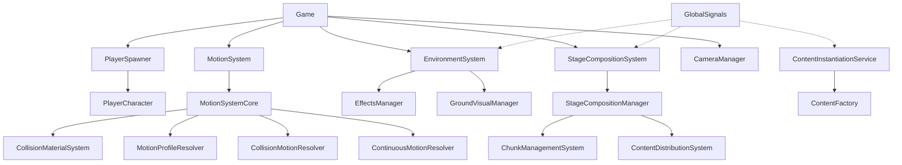

# Namoradinha

A physics-based game built with Godot 4.4, featuring a modular architecture with specialized systems for motion, environment, stage composition, and more.

## Project Overview

Namoradinha is a game that focuses on smooth physics-based movement, dynamic stage generation, and environment theming. The player character bounces and slides through procedurally generated stages with varying themes and obstacles.

## Architecture

The project follows a modular design with clear separation of concerns:

### Core Systems

1. **Game System**: Orchestrates the overall game flow and initializes other systems.
   - `Game.gd`: Main game controller
   - `GameInitializer.gd`: Handles initialization of subsystems

2. **Motion System**: Handles physics, movement, and collision responses.
   - `MotionSystem.gd`: Facade for the motion system
   - `MotionSystemCore.gd`: Core implementation with subsystem management
   - Various subsystems for specific motion behaviors (bounce, boost, etc.)

3. **Environment System**: Manages visual aspects like effects and ground.
   - `EnvironmentSystem.gd`: Coordinates environment managers
   - `EffectsManager.gd`, `GroundVisualManager.gd`: Handle specific visual elements

4. **Stage Composition System**: Dynamically generates and manages the game stage.
   - `StageCompositionSystem.gd`: Facade for stage generation
   - `StageCompositionManager.gd`: Core implementation
   - `ChunkManagementSystem`, `ContentDistributionSystem`: Handle stage layout and content

5. **Player System**: Controls the player character and its interactions.
   - `PlayerCharacter.gd`: Player controller with physics integration
   - `PlayerSpawner.gd`: Handles player creation and initialization

6. **Communication**: Uses signal buses for decoupled communication.
   - `GlobalSignals.gd`: Global event bus
   - `ContentInstantiationService.gd`: Handles content creation requests

## Design Principles

The codebase adheres to the following principles:

- **DRY (Don't Repeat Yourself)**: Avoid code duplication through proper abstraction.
- **KISS (Keep It Simple, Stupid)**: Prefer simple, clear solutions over complex ones.
- **SRP (Single Responsibility Principle)**: Each class/module has one clear responsibility.
- **Separation of Concerns**: Systems are modular and focused on specific aspects.
- **Composition Over Inheritance**: Prefer component-based design over deep inheritance hierarchies.
- **Readability First**: Code should be self-documenting and easy to understand.
- **Fail Fast**: Never swallow errors or allow silent failure.

## Code Style Guidelines

- **File Size**: No script should exceed ~100/150 lines. If it does, decompose it.
- **Clarity Over Cleverness**: Avoid compressed logic or tricky one-liners.
- **Comments**: Only comment on non-obvious logic; avoid restating what the code already says.
- **Documentation**: Document the system as it exists, not what it might do later.

## Extension Points

The modular architecture provides several extension points:

1. **Motion Subsystems**: Add new movement mechanics by creating a subsystem that implements `IMotionSubsystem`.
2. **Environment Themes**: Create new visual themes by adding resources to `resources/environment/themes/`.
3. **Stage Content**: Add new obstacles or items by extending the content system.
4. **Collision Materials**: Define new surface materials using the `MaterialType` component or `CollisionMaterialSystem`.

## Getting Started

1. Open the project in Godot 4.4 or later.
2. Run the main scene (`game/Game.tscn`).
3. For development, check the system-specific README files in each directory for more details.

## System Documentation

For more detailed information about specific systems, see the README files in their respective directories:

- [Motion System](scripts/motion/README.md)
- [Environment System](scripts/environment/README.md)
- [Stage System](scripts/stage/README.md)
- [Collision Materials](scripts/collision_materials/README.md)
