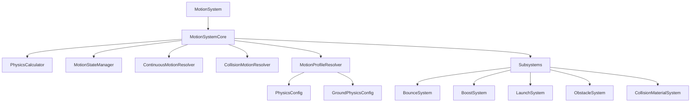
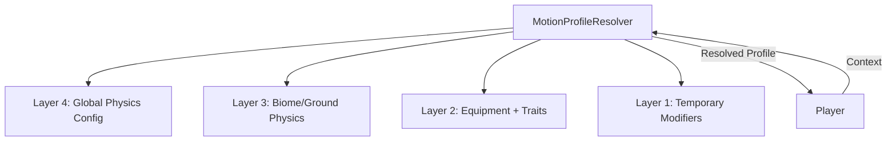

<!--
WARNING: This file is automatically generated from scripts/motion/README.md.
Do not edit this file directly. Make changes to the source README.md instead.
Last updated: 2025-04-24 19:38:03
-->

# Motion System

The Motion System is responsible for handling all physics and movement-related functionality in the game. It provides a framework for calculating motion, resolving collisions, and applying various motion modifiers.

## Architecture

The Motion System follows a layered architecture with a facade pattern:



### Core Components

1. **MotionSystem (`MotionSystem.gd`)**: 
   - Facade that provides a simplified interface to the rest of the game
   - Delegates most calls to the MotionSystemCore

2. **MotionSystemCore (`MotionSystemCore.gd`)**: 
   - Central component that manages subsystems and coordinates motion resolution
   - Handles subsystem registration and signal connections
   - Orchestrates the motion resolution process

3. **Motion Resolvers**:
   - **ContinuousMotionResolver**: Handles frame-by-frame motion (gravity, friction, etc.)
   - **CollisionMotionResolver**: Handles collision responses (bounces, slides, etc.)
   - **MotionProfileResolver**: Resolves motion parameters based on context (biome, etc.)

4. **Support Components**:
   - **PhysicsCalculator**: Performs physics calculations
   - **MotionStateManager**: Manages motion state transitions

### Subsystems

The Motion System uses a subsystem architecture to allow for modular extension of functionality:

- **BounceSystem**: Handles bounce physics and effects
- **BoostSystem**: Handles player-initiated boosts
- **LaunchSystem**: Handles launching the player
- **ObstacleSystem**: Handles interactions with obstacles
- **CollisionMaterialSystem**: Handles material-specific collision responses

Each subsystem implements the `IMotionSubsystem` interface and can provide modifiers that affect motion calculations.

## Configuration

The Motion System is configured through several resource files:

- **PhysicsConfig (`resources/physics/default_physics.tres`)**: Global physics parameters
- **GroundPhysicsConfig (`resources/motion/profiles/ground/*.tres`)**: Biome-specific ground physics

## Physics Resolution Architecture

The Motion System uses a layered approach to resolve physics parameters, allowing different sources to influence the final behavior in a predictable, priority-based manner.

### Layered Resolution Model



Physics parameters are resolved by applying configurations in reverse priority order (lowest priority first):

1. **Layer 4: Global Physics Config**
   - Source: `PhysicsConfig` (`resources/physics/default_physics.tres`)
   - Purpose: Defines baseline physics parameters for the entire game
   - Examples: Bounce thresholds, material properties, boost strengths

2. **Layer 3: Biome/Ground Physics**
   - Source: `GroundPhysicsConfig` (`resources/motion/profiles/ground/{biome_id}_ground.tres`)
   - Purpose: Defines environment-specific physics modifications
   - Examples: Ice has low friction, mud has high drag
   - Future: May expand to include air physics, water physics, etc.

3. **Layer 2: Equipment + Traits** (Planned)
   - Source: Future `EquipmentProfile` and `TraitProfile` resources
   - Purpose: Defines character-specific physics modifications
   - Examples: Ice boots increase friction on ice, lightweight trait reduces gravity

4. **Layer 1: Temporary Modifiers** (Planned)
   - Source: Status effects, powerups, environmental conditions
   - Purpose: Defines temporary physics modifications
   - Examples: Speed boost, slowing effect, wind gust

### Resolution Process

The `MotionProfileResolver.resolve_motion_profile()` method:

1. Starts with default values for all parameters
2. Applies each configuration layer in sequence
3. Later layers can override values from earlier layers
4. Tracks the source of each parameter for debugging
5. Returns a complete profile with all resolved parameters

### Biome and Equipment Interaction

This layered approach enables sophisticated interactions between biomes and character equipment:

```gdscript
# Example scenario: Player with ice boots in a mud biome

# Layer 4: Global Physics (baseline values)
# friction = 0.2 (default)

# Layer 3: Mud Biome (environment-specific)
# friction = 0.4 (high friction from mud)

# Layer 2: Ice Boots (character-specific)
# friction = 0.1 (low friction from boots)

# Result: friction = 0.1 (equipment overrides biome)
```

This allows for gameplay mechanics like:
- Equipment that counters specific biome challenges
- Traits that provide advantages in certain environments
- Specialized gear for different environmental conditions

### Implementation Status

- **Implemented**: Layers 4 (Global) and 3 (Biome)
- **Planned**: Layers 2 (Equipment/Traits) and 1 (Temporary)

### Extending the System

To add new configuration sources:

1. Define a new config class (e.g., `AirPhysicsConfig`)
2. Add a member variable in `MotionProfileResolver` (e.g., `_air_config`)
3. Create a setter method (e.g., `set_air_config()`)
4. Add a loading method (e.g., `update_air_config_for_biome()`)
5. Update the `resolve_motion_profile()` method to apply the new config
6. Create resource files (e.g., `default_air.tres`, `forest_air.tres`)

### Debugging

The system tracks the source of each parameter, allowing you to see which layer provided each value:

```gdscript
# Enable debug output
motion_profile_resolver.set_debug_enabled(true)

# Output example:
# MotionProfileResolver: Resolved profile for player 12345:
#   - friction: 0.100 (equipment)
#   - bounce: 0.800 (default)
#   - drag: 0.300 (ground)
```

This helps diagnose unexpected behavior and verify that overrides are working correctly.

## Usage

### Integrating with Player Character

The player character interacts with the Motion System through several methods:

```gdscript
# In _physics_process
var motion_context = {
    "entity_id": entity_id,
    "entity_type": "player",
    "player_node": self,
    "position": position,
    "velocity": velocity,
    "delta": delta,
    # ... other context data
}

# Resolve frame motion
var motion_result = motion_system.resolve_frame_motion(motion_context)

# Apply results
velocity = motion_result.velocity
has_launched = motion_result.has_launched
is_sliding = motion_result.is_sliding

# Handle collisions
var collision_info = {
    "entity_id": entity_id,
    "position": position,
    "normal": collision.get_normal(),
    "velocity": velocity_before_slide,
    "material": material_type,
    # ... other collision data
}

var collision_result = motion_system.resolve_collision(collision_info)
```

### Creating a New Subsystem

To create a new motion subsystem:

1. Create a new script that extends `RefCounted` and implements the `IMotionSubsystem` interface:

```gdscript
class_name MyNewSubsystem
extends RefCounted

# Reference to the motion system
var _motion_system = null

# Return the subsystem name
func get_name() -> String:
    return "MyNewSubsystem"

# Called when the subsystem is registered
func on_register() -> void:
    pass

# Called when the subsystem is unregistered
func on_unregister() -> void:
    pass

# Return modifiers for continuous motion
func get_continuous_modifiers(delta: float) -> Array:
    var modifiers = []
    # Add modifiers here
    return modifiers

# Return modifiers for collision events
func get_collision_modifiers(collision_info: Dictionary) -> Array:
    var modifiers = []
    # Add modifiers here
    return modifiers

# Optional: Return signal dependencies
func get_signal_dependencies() -> Array:
    return [
        {
            "provider": "LaunchSystem",
            "signal_name": "entity_launched",
            "method": "_on_entity_launched"
        }
    ]
```

2. Add the subsystem path to `_subsystem_paths` in `MotionSystemCore.gd`:

```gdscript
var _subsystem_paths = [
    # ... existing subsystems
    "res://scripts/motion/subsystems/my_new_subsystem/MyNewSubsystem.gd"
]
```

## Motion Modifiers

Motion modifiers are used to affect motion calculations. They can be created using the `MotionModifier` class:

```gdscript
var modifier = MotionModifier.new(
    "MyNewSubsystem",  # source
    "friction",        # type
    10,                # priority
    Vector2(0, 0),     # vector (no direction change)
    0.5,               # scalar (e.g., friction value)
    false,             # is_additive (replace or add)
    1.0                # duration (in seconds, -1 for permanent)
)
```

## Debugging

The Motion System includes debugging functionality that can be enabled:

```gdscript
motion_system.set_debug_enabled(true)
```

This will output detailed information about motion calculations, subsystem registration, and more.

## Best Practices

1. **Use the Facade**: Always interact with the Motion System through the `MotionSystem` facade, not directly with `MotionSystemCore`.
2. **Context-Rich Information**: Provide as much context as possible in motion and collision info dictionaries.
3. **Subsystem Independence**: Design subsystems to be independent of each other. Use signal dependencies for communication.
4. **Profile-Based Configuration**: Use the `MotionProfileResolver` for context-specific motion parameters rather than hardcoding values.
5. **Error Handling**: Check return values and handle errors gracefully.

## Potential Expansions

The Motion System is designed to be extensible. Here are some potential expansions that could be implemented in the future:

### Player Status Modifier System

A subsystem for managing temporary status modifiers that affect player attributes and behavior.

**Features:**
- Manages temporary status modifiers with durations (shields, invincibility, speed boosts, slowing effects)
- Applies and removes modifiers based on their lifetime
- Provides motion modifiers that affect player movement and behavior

**Implementation:**
1. Create a `PlayerStatusModifierSystem` class implementing the `IMotionSubsystem` interface
2. Define specific modifier types in a dedicated directory (e.g., `scripts/player_status_modifiers/`)
3. Implement an interface for status modifiers (e.g., `IPlayerStatusModifier`)
4. Register the system in `MotionSystemCore.gd`

**Example Usage:**
```gdscript
var status_system = motion_system.get_subsystem("PlayerStatusModifierSystem")
if status_system:
    status_system.apply_modifier("shield", 10.0, 1.0) # Apply shield for 10 seconds at full strength
```

### Other Potential Subsystems

- **EquipmentSystem**: Handle equipment that affects player movement
- **TraitSystem**: Manage permanent player traits that modify motion
- **EnvironmentalForceSystem**: Handle environmental forces like wind, currents, etc.
