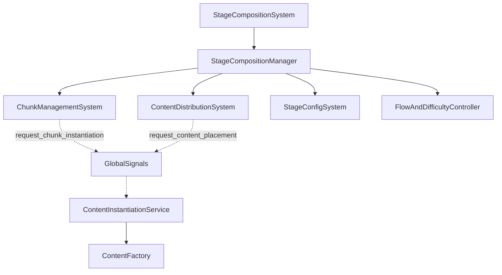

<!--
WARNING: This file is automatically generated from scripts/stage/README.md.
Do not edit this file directly. Make changes to the source README.md instead.
Last updated: 2025-04-24 19:38:03
-->

# Stage Composition System

The Stage Composition System is responsible for dynamically generating and managing the game stage. It handles chunk creation, content distribution, and flow/difficulty adjustment based on player performance.

## Directory Structure

The Stage Composition System follows this directory structure:

- `scripts/stage/` - Contains all GDScript (.gd) files for the Stage Composition System
- `stage/` - Contains all scene (.tscn) files that use those scripts

This separation of scripts and scenes is a standard pattern throughout the project.

## Architecture

The Stage Composition System follows a layered architecture with specialized subsystems:



### Core Components

1. **StageCompositionSystem (`StageCompositionSystem.gd`)**: 
   - Facade that provides a simplified interface to the rest of the game
   - Delegates most calls to the StageCompositionManager

2. **StageCompositionManager (`StageCompositionManager.gd`)**: 
   - Central component that coordinates stage generation and management
   - Handles game modes (story, arcade) and stage transitions
   - Manages the flow and difficulty of the stage

3. **Subsystems**:
   - **ChunkManagementSystem**: Manages the creation, placement, and recycling of stage chunks
   - **ContentDistributionSystem**: Determines what content (obstacles, items, etc.) to place in each chunk
   - **StageConfigSystem**: Loads and manages stage configuration resources
   - **FlowAndDifficultyController**: Adjusts difficulty based on player performance

4. **Content Creation**:
   - Stage components emit signals to request content creation
   - `GlobalSignals` routes these requests to the `ContentInstantiationService`
   - `ContentFactory` creates the actual content objects

## Stage Generation Process

The stage generation process follows these steps:

1. A stage generation is requested with a config ID and game mode
2. The `StageConfigSystem` loads the corresponding `StageCompositionConfig`
3. The `FlowAndDifficultyController` is initialized with the config's parameters
4. The `ChunkManagementSystem` generates initial chunks
5. As the player moves, new chunks are generated ahead and old ones recycled
6. The `ContentDistributionSystem` populates chunks with content based on the current difficulty and flow state

## Configuration

The Stage Composition System is configured through several resource files:

- **StageCompositionConfig (`resources/stage/configs/*.tres`)**: Defines stage parameters
- **ChunkDefinition (`resources/stage/chunks/*.tres`)**: Defines chunk layouts
- **ContentDistribution (`resources/stage/content_distributions/*.tres`)**: Defines content placement rules

## Game Modes

The system supports different game modes:

1. **Story Mode**:
   - Has a defined end condition (distance or event)
   - Follows a predetermined difficulty curve
   - Can transition to cutscenes or other stages

2. **Arcade Mode**:
   - Potentially endless
   - Dynamically adjusts difficulty based on player performance
   - Can transition to other arcade stages for variety

## Flow and Difficulty

The `FlowAndDifficultyController` adjusts the stage difficulty based on player performance:

1. **Flow States**:
   - FLOW_EASY: Player is struggling, reduce difficulty
   - FLOW_BALANCED: Player is performing as expected
   - FLOW_CHALLENGING: Player is excelling, increase difficulty

2. **Performance Metrics**:
   - Speed
   - Height
   - Combo chains
   - Obstacle avoidance
   - Collection rate

3. **Difficulty Adjustments**:
   - Content density
   - Obstacle complexity
   - Reward placement
   - Special event frequency

## Usage

### Generating a Stage

To generate a stage:

```gdscript
# Using the StageCompositionSystem
stage_composition_system.generate_stage("default_stage", "story")

# Or via GlobalSignals
var config = stage_config_system.get_config("default_stage")
GlobalSignals.stage_generation_requested.emit(config, "arcade")
```

### Updating Player Position

The system needs to know the player's position to generate chunks ahead:

```gdscript
# In the player's _physics_process
stage_composition_system.update_player_position(position)
```

### Recording Performance

To enable dynamic difficulty adjustment:

```gdscript
# When the player performs an action
stage_composition_system.record_performance_event(
    FlowAndDifficultyController.PerformanceMetric.SPEED,
    player_speed
)
```

### Creating a Custom Stage

To create a custom stage:

1. Create a new `StageCompositionConfig` resource
2. Set the stage parameters (length, theme, difficulty, etc.)
3. Define the content distribution
4. Add chunk definitions
5. Save the config to `resources/stage/configs/`

## Chunk System

The chunk system is responsible for the physical layout of the stage:

1. **Chunk Definition**:
   - Defines the physical structure of a chunk
   - Can include predefined platforms, obstacles, etc.
   - Can define marker points for dynamic content placement

2. **Chunk Management**:
   - Chunks are instantiated ahead of the player
   - Old chunks are recycled when they're far behind the player
   - Chunks are positioned to create a continuous stage

3. **Chunk Types**:
   - **Default Chunks**: Standard chunks with basic layouts
   - **Random Chunks**: Chunks with randomized elements
   - **Varied Chunks**: Chunks with multiple possible configurations
   - **Special Chunks**: Chunks for specific events or challenges

## Content Distribution

The content distribution system determines what content to place in each chunk:

1. **Content Categories**:
   - Obstacles: Impede player progress
   - Collectibles: Provide rewards
   - Power-ups: Grant temporary abilities
   - Decorations: Visual elements with no gameplay effect

2. **Distribution Rules**:
   - Based on difficulty level
   - Influenced by flow state
   - Can be biome/theme specific
   - Can create patterns or sequences

3. **Placement Strategies**:
   - Grid-based placement
   - Height zone placement
   - Pattern-based placement
   - Random placement with constraints

## Analytics

The Stage Composition System emits analytics events to track player progress and system performance:

```gdscript
GlobalSignals.analytics_event.emit({
    "event_type": "stage_generated",
    "stage_id": config.id,
    "game_mode": game_mode,
    "theme": config.theme,
    "difficulty": config.target_difficulty
})
```

These events can be used for debugging, balancing, and player behavior analysis.

## Debugging

The system includes debugging functionality:

1. **Debug Overlay**: Shows information about chunks, content, flow state, etc.
2. **Debug Methods**: Methods to inspect the current state of the system
3. **Debug Prints**: Detailed logging when debug mode is enabled

## Best Practices

1. **Config-Driven Design**: Use configuration resources rather than hardcoded values
2. **Balanced Difficulty**: Ensure the difficulty curve is smooth and responsive
3. **Performance Optimization**: Recycle chunks and content to minimize instantiation
4. **Visual Consistency**: Coordinate with the Environment System for theme consistency
5. **Extensibility**: Design chunk and content systems to be easily extended

## System Integration

To integrate the Stage Composition System into a game:

1. Add the StageCompositionSystem scene to your game scene
2. Initialize it with the player node for tracking:
   ```gdscript
   # Set the player node for tracking
   stage_composition_system.set_player_node(player_character)
   ```
3. Generate a stage with the desired configuration:
   ```gdscript
   # Generate the initial stage
   stage_composition_system.generate_stage("default_stage", "story")
   ```
4. Update the player position in your game loop:
   ```gdscript
   # In _process or _physics_process
   stage_composition_system.update_player_position(player_character.global_position)
   ```
5. Record performance metrics to enable dynamic difficulty adjustment:
   ```gdscript
   # When player collects items, hits obstacles, etc.
   stage_composition_system.record_performance_event(
       FlowAndDifficultyController.PerformanceMetric.COLLECTIBLE_COLLECTION_RATE,
       1.0
   )
   ```

## Legacy Systems

Note that the older `scripts/stages/StageManager.gd` has been removed from the project. All code should use the Stage Composition System.
