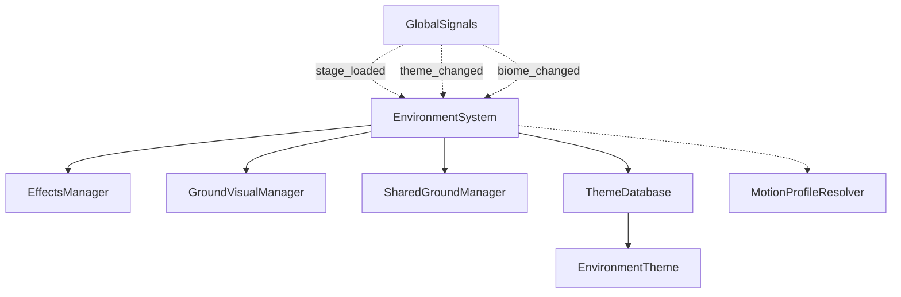
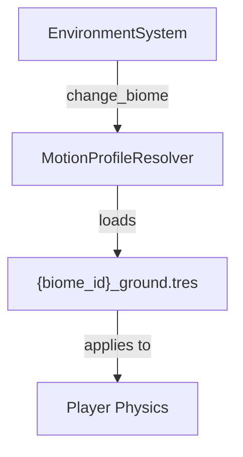
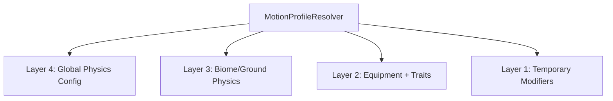

# Environment System

The Environment System manages the visual aspects of the game world, including backgrounds, effects, and ground visuals. It coordinates multiple visual managers and handles theme/biome transitions.

## Architecture

The Environment System follows a manager-based architecture:



### Core Components

1. **EnvironmentSystem (`EnvironmentSystem.gd`)**: 
   - Central coordinator for all environment-related functionality
   - Manages theme and biome changes
   - Coordinates visual transitions between themes

2. **Visual Managers**:
   - **EffectsManager**: Manages visual effects like particles and animations
   - **GroundVisualManager**: Controls the appearance of ground surfaces

3. **Ground Management**:
   - **SharedGroundManager**: Creates and manages a shared ground for the entire level
   - **GroundVisualManager**: Handles visual representation of ground surfaces
   - Note: Ground visuals are now primarily handled by the chunk system in StageCompositionSystem, which has replaced the old GroundManager functionality

4. **Configuration**:
   - **ThemeDatabase**: Collection of all available environment themes
   - **EnvironmentTheme**: Defines visual properties for a specific theme
   - **StageConfig**: Links themes to stages

## Theme System

The Environment System uses a theme-based approach to visual styling:

1. **Themes**: Define the overall visual style (colors, textures, effects)
   - Stored as resources in `resources/environment/themes/`
   - Each theme has a unique ID (e.g., "default", "ice", "desert")

2. **Biomes**: Define the physical properties of the environment
   - Affect ground physics (friction, bounce, etc.)
   - Linked to ground physics configs in `resources/motion/profiles/ground/`

3. **Theme Application**:
   - When a theme is applied, it's distributed to all visual managers
   - Each manager handles its specific visual elements
   - Transitions are coordinated to ensure smooth visual changes

## Biome System Architecture

The biome system is designed with a modular, expandable architecture:

### Current Implementation

Currently, biomes primarily affect ground physics through `GroundPhysicsConfig` resources:
- Resources are stored as `resources/motion/profiles/ground/{biome_id}_ground.tres`
- Each biome has specific ground physics properties (friction, bounce, etc.)
- The `_ground` suffix in filenames indicates these resources specifically control ground physics



### Planned Expansion

The biome system is designed to expand beyond ground physics in the future:

1. **Air Physics**: Future air-related configs will define biome-specific air properties
   - Referenced in code comments as `_air_config`
   - Would likely handle wind effects and air movement

2. **Environmental Forces**: As mentioned in the Motion System README
   - Environmental forces like wind and currents
   - Biome-specific environmental effects

3. **Theme Integration**: 
   - Comment in EnvironmentSystem.gd: "In the future, biomes might affect theme selection"

### Interaction with Equipment and Traits

The Motion System's layered physics resolution allows biomes to interact with player equipment and traits:



This architecture enables gameplay mechanics like:
- Equipment that counters specific biome challenges (e.g., ice boots in a slippery biome)
- Traits that provide advantages in certain environments
- Specialized gear for different biome types

For more details on this interaction, see the "Physics Resolution Architecture" section in the Motion System README.

## Integration with Physics and Stage Systems

The Environment System integrates with other systems in several ways:

### Physics Integration

The Environment System integrates with the physics system through the `MotionProfileResolver`:

1. When a biome changes, the Environment System updates the ground physics configuration in the `MotionProfileResolver`
2. This affects how the player character interacts with the environment (friction, bounce, etc.)

### Stage Composition Integration

The Environment System works alongside the Stage Composition System:

1. **Division of Responsibilities**:
   - Environment System: Handles theme application, visual transitions, and biome physics
   - Stage Composition System: Handles chunk generation, content distribution, and ground structure

2. **Architectural Evolution**:
   - The old GroundManager functionality has been replaced by the chunk system in StageCompositionSystem
   - GroundVisualManager now focuses on visual representation rather than structural management
   - SharedGroundManager provides a simplified ground collision layer for the entire level

3. **Communication Flow**:
   - Stage events trigger environment changes via GlobalSignals
   - Environment changes (like biome updates) affect stage generation parameters

## Usage

### Applying Themes

Themes can be applied in several ways:

1. **Direct Method Call**:
```gdscript
environment_system.apply_theme_by_id("ice")
```

2. **Via Global Signal**:
```gdscript
GlobalSignals.theme_changed.emit("desert")
```

3. **Via Stage Config**:
```gdscript
var config = StageConfig.new()
config.theme_id = "jungle"
GlobalSignals.stage_loaded.emit(config)
```

### Changing Biomes

Biomes can be changed using the global signal:

```gdscript
GlobalSignals.biome_changed.emit("ice")
```

### Creating Custom Themes

To create a custom theme:

1. Create a new resource file inheriting from `EnvironmentTheme`
2. Set the theme properties (colors, textures, etc.)
3. Add the theme to the `ThemeDatabase`

```gdscript
var theme = EnvironmentTheme.new()
theme.theme_id = "custom_theme"
theme.ground_texture = preload("res://path/to/ground.png")
# Set other properties...

var theme_database = preload("res://resources/environment/theme_database.tres")
theme_database.add_theme(theme)
```

## Transitions

The Environment System handles smooth transitions between themes:

1. When a new theme is applied, all managers begin their transitions
2. Each manager signals when its transition is complete
3. The Environment System emits a `transition_completed` signal when all transitions are done

This allows for coordinated visual changes across all environment elements.

## Debugging

The Environment System includes debugging functionality:

1. **Debug Overlay**: In debug builds, an overlay can be shown to display current theme and biome information
2. **Debug Theme Switching**: In debug builds, pressing keys 1-2 switches between themes

## Best Practices

1. **Theme Consistency**: Ensure all visual elements (background, ground, effects) are consistent within a theme
2. **Biome-Theme Alignment**: Match biome physics properties with theme visuals for a cohesive experience
3. **Transition Timing**: Keep transitions short and smooth to avoid disrupting gameplay
4. **Resource Management**: Preload theme resources to avoid loading hitches during gameplay
5. **Fallback Handling**: Provide fallback visuals in case theme resources are missing
